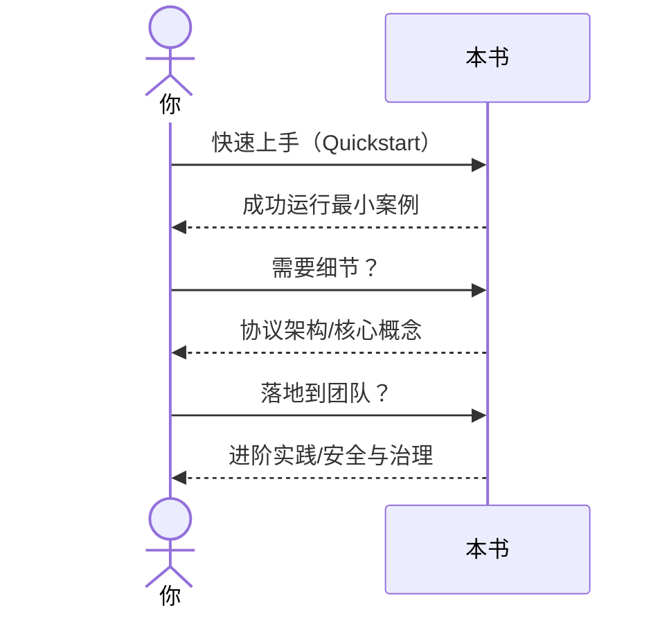

# 如何阅读此书？

> 这是一部面向**开发者与技术管理者**的实践型读本：我们既讨论 MCP（Model Context Protocol）的**协议原理**与**工程落地**，也覆盖从 IDE/桌面端到云端的**部署与安全治理**。为了让你高效吸收，本章给出阅读路径、章节导航、示例运行方式与排错建议。你无需从头到尾“逐字啃”，按需跳读、边学边做即可。

---

## 1. 你将从本书获得什么

* **系统化理解 MCP**：从“为什么需要协议”到“请求—响应模型、上下文传递、传输层、权限与隔离”，形成一张完整的心智地图。
* **工程化落地路径**：如何在本地 IDE、CI/CD、云端服务中集成 MCP；如何把浏览器、数据库、文件系统等资源以**工具服务器**的方式安全暴露给 AI。
* **可复用的样例与脚手架**：附带的 `samples/` 目录与命令行脚本能直接运行，帮助你把“概念”转化为“可执行的最小案例”。
* **最佳实践与避坑指南**：性能、可靠性、安全与审计；何时选择 HTTP / WebSocket / Stdio；如何把多步工具调用编排成**闭环交互**。

---

## 2. 面向不同读者的“快速路径”

> 不同背景、不同目标，对应不同阅读顺序。以下建议可作为“导航书签”。

### 2.1 我是入门读者 / 产品经理

* 建议顺序：

  1. `00-preface/00-intro.md`（本书动机与范围）
  2. `01-foundation/01-what-is-mcp.md`（MCP 是什么、解决什么）
  3. `01-foundation/03-quickstart.md`（10–20 分钟跑通最小示例）
  4. `02-core-concepts/01-tab-and-context.md`、`02-snapshot-and-aria.md`（理解上下文与可用工具）
  5. `03-practice-cases/*`（挑 1–2 个案例直观看效果）

> 目标：建立“**MCP = AI 的 USB-C**”的直觉，能说清楚商业价值与工程边界。

### 2.2 我是后端/平台工程师

* 建议顺序：

  1. `01-foundation/02-protocol-architecture.md`（请求—响应、上下文、传输层）
  2. `04-advanced-topics/01-extension-mcp-server.md`（自建 MCP 服务器）
  3. `04-advanced-topics/02-embedding-llm.md`（将 LLM/代理与 MCP 编排）
  4. `05-open-source-and-ecosystem/02-open-standards.md`（与周边标准对齐）
  5. `appendix/references.md`（接口与实现参考）

> 目标：能把你已有系统“以 MCP 方式”暴露出去，并接入企业认证、审计、限流与观测。

### 2.3 我是前端/自动化/测试工程师

* 建议顺序：

  1. `03-practice-cases/case01-login-demo.md`、`case02-form-fill.md`、`case03-report-export.md`
  2. `04-advanced-topics/03-browser-devtools-link.md`（以 Chrome DevTools MCP 做闭环调试）
  3. `04-advanced-topics/04-debug-and-optimize.md`（性能追踪、故障诊断）

> 目标：把“人肉点点点”的回归/验收流程迁移为**自然语言驱动的浏览器自动化**。

### 2.4 我是安全负责人 / 架构师

* 建议顺序：

  1. `01-foundation/02-protocol-architecture.md`（会话、作用域、边界）
  2. `04-advanced-topics/04-debug-and-optimize.md`（稳定性与可观测性）
  3. `05-open-source-and-ecosystem/04-future-trends.md`（生态与风险趋势）
  4. `appendix/glossary.md`、`appendix/references.md`（术语、原始规范）

> 目标：建立**最小权限 + 沙箱 + 审批 + 审计**的治理模型，评估引入成本与合规影响。

---

## 3. 章节地图与跳读指引

* **前言与使用说明（`00-preface/`）**：为什么写本书、如何运行样例、常见问题。
* **基础篇（`01-foundation/`）**：

  * `01-what-is-mcp.md`：MCP 的背景、价值与术语。
  * `02-protocol-architecture.md`：**本书核心**，讲清请求—响应、上下文传递、传输层与安全模型。
  * `03-quickstart.md`：5–10 条命令跑通最小系统。
  * `04-basic-commands.md`：常用命令/工具的“词典”。
* **核心概念篇（`02-core-concepts/`）**：会话/作用域/资源、DOM 快照与可访问性、工具 Schema 与协议消息、代理与宿主的通信。
* **实战案例篇（`03-practice-cases/`）**：从登录、表单、导出到自动化套件；每个案例有**前置、脚本、日志与排错**。
* **进阶篇（`04-advanced-topics/`）**：自建 MCP 服务器、与 LLM 的编排、与 DevTools 的深度联动、调试与优化。
* **生态篇（`05-open-source-and-ecosystem/`）**：社区项目、开放标准、与各类 Agent/IDE/云平台的集成、未来趋势。
* **附录（`appendix/`）**：术语表、参考链接、变更记录；方便“查字典”。

> **如何跳读？**
>
> * “我要跑得起来”：直接看 `03-quickstart.md` → 任意 `03-practice-cases/*`。
> * “我想搞清楚协议细节”：先 `02-protocol-architecture.md`，不懂再回 `01-what-is-mcp.md`。
> * “我要上生产”：再看 `04-advanced-topics/*` 与 `05-open-source-and-ecosystem/*`。

---

## 4. 本书的写作约定与图示说明

* **代码块**：均可复制执行；如涉及敏感命令（删除/外发），在注释中明确 `# DANGEROUS`。
* **文件路径**：统一使用相对路径，相对于项目根目录。
* **术语首次出现**会给出中文解释与英文全称；术语表在 `appendix/glossary.md`。
* **提示块**：

  * **Note**：补充说明/背景知识
  * **Tip**：实践小技巧/易忽略优化点
  * **Caution**：潜在风险/副作用
  * **Troubleshoot**：常见错误与快速定位方法
* **图示**：使用 Mermaid 绘制**流程/时序/结构图**；图下文字备注“阅读重点”。

> 示例（阅读法则时序小图）：



---

## 5. 如何运行样例与复现实验

1. **安装前置**：`Node.js (>= 20.19) / npm / Chrome（稳定版）`；（如用 Python 栈的案例，章节内会明确要求）。
2. **克隆仓库**：

   ```bash
   git clone <your-book-repo>
   cd <repo-root>
   ```
3. **进入样例目录**（如 `samples/chrome-devtools/` 或 `samples/unified-automation/`），阅读该目录下的 `README.md`。
4. **一键脚本**：我们提供 `npm run dev` / `make run` 或 `./scripts/run.sh`；首次运行会自动安装依赖。
5. **配置 MCP**：

   * 本地 IDE/桌面（如 Cherry Studio / Cursor / Claude Desktop）：在设置中添加 `mcpServers` 配置，指向本地或远程 MCP 服务器。
   * 运行时注意“工具开启/关闭”与**权限弹窗**（敏感操作需要确认）。
6. **可视化验证**：样例多数会生成**截图、trace 或日志**于 `assets/screenshots/`、`assets/diagrams/`；对照文中预期结果校验。
7. **复现实验**：我们在每个案例的结尾给出**固定种子、参数与数据版本**；如涉及第三方数据集，提供下载脚本与校验哈希。

> **Troubleshoot**
>
> * 找不到 Chrome：按章节说明配置自定义路径或 `--browserUrl`；
> * 网站拦机器人：需要**手动一次性验证**或更换目标站点；
> * 工具超时：提高 `timeout`、检查网络代理、在 WebSocket 模式下重试并启用详细日志。

---

## 6. 如何在团队内采纳本书的方法

* **从一个“可见价值”的小点开始**：选“登录 + 表单 + 导出”这样的高频回归任务，做成**自然语言→自动化**的闭环。
* **搭建“工具目录”**：用 MCP 把你们已有的脚本/API/微服务统一暴露为工具服务器；沉淀**自家可复用资产**。
* **引入“最小权限 + 审批 + 审计”**：默认只读，危险操作二次确认；启用日志与追踪保证可回溯。
* **度量价值**：统计“人工分钟数→自动化秒数”的对比、失败重试率、逃逸到人工的比例；以数据推动扩面。
* **形成“模式库”**：把成功的调用链（如“trace→分析→优化建议→验证”）抽象成**可复制 playbook**。

---

## 7. 版本与兼容性

* **版本标注**：章节会在开头标注“验证日期/依赖版本”。
* **兼容性提示**：若接口或行为随 SDK/浏览器更新而改变，会在 `appendix/changelog.md` 中记录迁移方式。
* **可重复性**：样例使用锁定依赖与固定数据，确保你在相同版本下得到一致结果。

---

## 8. 提问、反馈与贡献

* **提问与勘误**：在项目仓库提交 Issue，尽量附上**操作步骤、日志、截图**与环境信息。
* **分享最佳实践**：欢迎 PR 添加新的工具服务器、脚手架或案例。
* **路线建议**：在 Discussions 提出你希望增加的章节（如“移动端 DevTools MCP”、“CI 无头浏览器最佳实践”等）。

---

## 9. 读书的三条小建议（强烈推荐）

1. **边读边跑**：任何“看起来懂了”的协议/调用，**不跑一遍都算没学会**。
2. **做自己的最小闭环**：把你手头最常做、最烦的任务改造成 MCP 工具链（哪怕是两个工具拼起来也行）。
3. **把“安全与审计”前置**：一开始就养成“最小权限、可回溯”的工程习惯，后续扩张会省很多成本。

---

> **总结**：
> 本书希望你**按需跳读、立即实践、逐步体系化**。当你能熟练地把“自然语言 → 工具调用 → 可视化验证 → 安全审计”串成一条稳定的流水线，MCP 才真正变成了你的“AI USB-C”。祝阅读顺利，产能倍增。
