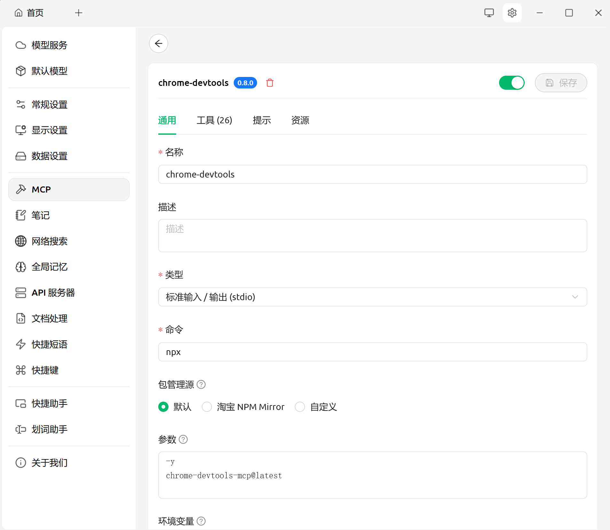
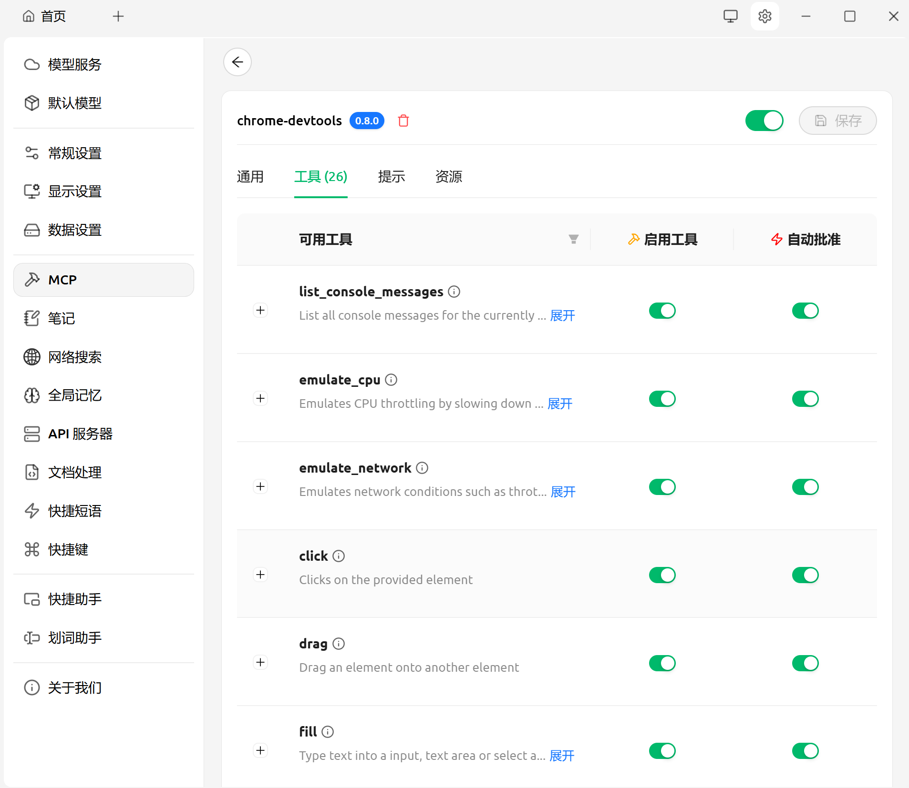

# 第2节 Chrome DevTools MCP 的配置与运行

在本节中，我们将完成从环境准备、配置到运行验证的全过程。  
目标是让读者能够在自己的设备上快速启动 **Chrome DevTools MCP**，并在支持 MCP 协议的 AI 应用中使用它（这里以 Cherry Studio 为例）。  
完成本节后，你的智能体将真正获得“控制浏览器”的能力。

---

## 2.1 前置要求

在开始配置之前，请确保本地环境已经具备以下条件：  

首先，你需要安装 **Node.js**（建议版本不低于 v20.19 LTS）。  
Node.js 是整个 MCP 运行的底层依赖，建议使用官方 LTS 版本，以避免兼容性问题。  
安装 Node.js 后，系统会自动包含 **npm** 包管理工具，用于安装和运行相关依赖。  

其次，必须确保系统中已安装 **Google Chrome 浏览器**，并更新至最新的稳定版本。  
Chrome DevTools MCP 基于 Chrome DevTools Protocol 运行，因此浏览器版本过旧会导致部分命令失效。  

最后，你需要一个支持 **MCP 协议** 的 AI 智能体应用。  
目前有多个客户端支持该协议，例如 Anthropic 的 Claude、Cursor 编辑器、Gemini CLI 等，本节使用 **Cherry Studio** 进行演示。  

> 提示：安装完成后，可在命令行中运行 `node -v` 和 `npm -v` 检查环境是否就绪。  
> 若要验证 Chrome 是否可被 DevTools 协议调用，可运行 `chrome.exe --remote-debugging-port=9222` 测试。

---

## 2.2 在 Cherry Studio 中配置 Chrome DevTools MCP

打开 Cherry Studio，点击右上角的 **设置（Settings）** 图标，进入 **MCP** 配置页面。  
在该页面中，点击“编辑”按钮，找到 `mcpServers` 区域，这里用于定义可被 AI 调用的 MCP 服务。

在编辑框中添加以下配置代码，并保存：

```json
{
  "mcpServers": {
    "chrome-devtools": {
      "command": "npx",
      "args": ["-y", "chrome-devtools-mcp@latest"]
    }
  }
}
```

这段配置的含义是：当模型调用 MCP 时，Cherry Studio 将通过 `npx` 启动名为 `chrome-devtools-mcp` 的服务。
其中 `-y` 参数表示跳过安装确认，`@latest` 代表使用最新版本。
配置保存后，你应能在 MCP 服务器列表中看到 **chrome-devtools** 项。

点击条目进入详情页面，会看到工具的完整列表，目前共 20 余个工具。
这些工具对应浏览器的不同操作接口，例如导航（`navigate_page`）、点击（`click`）、填表（`fill_form`）、日志读取（`list_console_messages`）、性能追踪（`performance_start_trace`）等。
确认所需工具处于“启用”状态后，返回主页，在输入框下方选择 MCP 源，启用 `chrome-devtools`。
至此，配置步骤完成。


---


## 2.3 常见问题与排查方法

虽然配置过程简单，但在不同环境下可能会遇到一些常见问题。
下面列出了最典型的几类情况及其解决建议。

·如果系统提示 **Chrome 浏览器找不到**，大概率是因为程序无法在默认路径中定位到 Chrome 的可执行文件。
MCP 默认会尝试在 Windows 的 `C:\Program Files\Google\Chrome\Application\chrome.exe` 路径下查找。  
若你将 Chrome 安装在自定义目录，请在环境变量中指定路径，或创建一个软链接指向默认位置。

·若出现 **`fill` 或 `evaluate_script` 工具报错** 的情况，请手动打开目标网页查看。  
某些网站（例如 Google、Facebook 等）启用了自动化检测机制，会要求用户进行人机验证（reCAPTCHA）。
此时，AI 无法自行通过验证，需要你手动点击“继续”或在配置中关闭该安全检测。

第三，若 **MCP 服务启动失败** 或出现连接错误，请检查配置是否正确。
确保 JSON 格式有效，命令路径完整。
可以尝试在命令行中运行以下命令，验证 MCP 是否可启动：

```
npx chrome-devtools-mcp@latest
```

如果命令行能正常启动，说明问题出在 Cherry Studio 的配置路径或权限上。

还有一种常见情况是 **调用无响应或超时**。
这通常是因为网页加载缓慢、脚本阻塞或网络不稳定造成的。
可尝试在指令中加入等待逻辑（如“等待页面加载完成后再读取标题”），或减少同时运行的 MCP 工具。

此外，如果出现权限相关提示或沙箱限制，说明当前浏览器环境被系统安全策略拦截。
可以尝试在命令行参数中添加 `--no-sandbox` 运行，或以管理员权限执行。
需要注意的是，这种方式仅适用于本地测试，生产环境仍应使用隔离目录运行。

最后，若 MCP 工具调用结果异常，例如点击未生效、页面渲染不完整，可能是因为 Chrome 版本与 MCP 包版本不匹配。
建议更新 Chrome 至最新稳定版，或指定 MCP 的稳定版本号（例如 `chrome-devtools-mcp@0.2.7`），避免使用过新的测试版。

---

## 2.5 优化与使用建议

成功运行 MCP 后，你可以进一步对环境进行优化，使其在长时间使用中更稳定、更高效。

首先，建议不要长期使用 `@latest` 标签。
虽然它能确保获得最新版本，但也可能在自动更新后引入不兼容问题。
生产环境可固定使用经过验证的版本号，例如：

```
"args": ["-y", "chrome-devtools-mcp@0.2.7"]
```

其次，可以在调试阶段开启 **verbose 模式** 或 **debug 日志输出**。
这样，当工具调用失败或浏览器无响应时，日志能帮助你追踪具体命令与返回信息。

另外，建议开启 **隔离用户数据目录**。
这意味着 MCP 启动的浏览器不会共享你日常使用的 Chrome 配置（书签、Cookie、登录信息等），从而避免隐私泄露或环境污染。
MCP 默认已支持临时 Profile 模式，每次运行都会新建并在任务结束后自动清理。

在性能方面，要避免一次性开启过多监听工具。
如非必要，不要同时运行 trace、network、DOM 快照等高频任务。
这些功能会持续占用资源，造成浏览器响应迟缓。

如果你计划在 CI/CD 流程或远程服务器中使用 MCP，可选择无头模式（`--headless=new`）启动 Chrome。
在 Docker 环境中，还需安装完整的 Chromium 包及字体依赖。

最后，进行复杂任务之前，建议先在简单页面（例如 `example.com` 或本地静态 HTML 文件）上测试连通性。
确认工具可用后，再逐步切换到业务页面，以便排除网络或脚本问题。

---

## 小结

至此，你已完成 Chrome DevTools MCP 的安装与配置，
掌握了在 Cherry Studio 中集成 MCP 服务的方法，
验证了最基本的浏览器操作，
并了解了常见错误的排查方式与运行优化技巧。

这一节的目标，是让 AI 真正具备通过 MCP 控制浏览器的能力。
接下来的章节将深入讲解 **MCP 工具调用语法** 与 **核心概念机制**，
帮助你从“能运行”走向“能理解”，
逐步构建属于自己的智能化网页调试与自动化体系。


