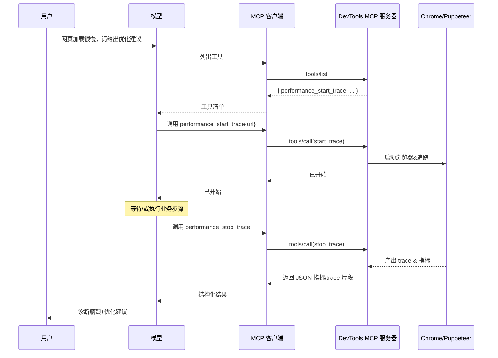

# 协议架构

> 本章系统剖析 Model Context Protocol（MCP）的协议架构：它为何需要协议抽象、如何以请求—响应模式统一工具调用、如何在多轮对话里可靠地传递上下文、支持哪些传输通道（HTTP/WebSocket/Stdio），以及在真实系统（以 Chrome DevTools MCP 为例）中如何落地安全模型与隔离策略。文末附有示意图与序列图，帮助你把抽象概念“看见”。

---

## 1. 协议模型与设计目标

### 1.1 为什么需要协议抽象

大型语言模型（LLM）要想“接触外界”，必须会**调用工具**与**读写数据**。在 MCP 之前，这通常靠各家模型平台的私有函数调用/插件系统完成：每接一个数据源或工具，就写一套适配；换一套模型或宿主，又要重写。随着工具数量和调用复杂度上升，这种“点对点”集成迅速走向失控。

**MCP 的核心价值**在于把“模型↔工具”的交互抽象成**统一协议层**：

* 工具以**自描述**形式暴露能力（名称、参数模式、返回结构）。
* 模型通过**标准化请求—响应**去调用，不再关心工具内部实现。
* 会话、状态、权限等**跨工具共性**在协议层统一解决。

直观类比：MCP 是 AI 世界的 **USB-C**。换了电脑（LLM/宿主）或外设（工具/数据源），只要都遵循同一接口规范，就可即插即用。

### 1.2 与“函数调用/插件”的区别

* **范围**：函数调用更像在单一应用里暴露若干“内置函数”；MCP 则是**跨应用/跨平台**的“工具服务层”。
* **解耦**：函数调用常紧耦合在某个宿主；MCP 把工具独立为**服务器**，任何兼容客户端都能复用。
* **多步交互与上下文**：MCP 原生支持会话/状态/作用域，使复杂任务**可串联、可追踪**；函数调用通常偏一次性。
* **生态**：有了统一协议，工具可沉淀为**可迁移资产**，减少“重复造轮子”。

---

## 2. 请求—响应调用模式

MCP 使用**结构化消息（JSON-RPC 2.0）**定义模型与工具服务器之间的请求与响应，令跨语言、跨环境的调用都能遵循同一约定。

### 2.1 工具的“自描述”与发现

* 服务器在**握手/初始化**后向客户端公布一份**工具清单**：

  * `name`：工具名（唯一标识）。
  * `description`：功能说明（供模型理解与选择）。
  * `input_schema`：参数模式（通常为 JSON Schema）。
  * `output_schema`：返回结构（选填；若省略，也建议返回结构化 JSON）。
* 客户端据此把**可用工具**放入模型上下文，使模型“知道能做什么、需要哪些参数”。

> 例（简化）：
>
> * `database_query`：输入 `{query: string}`，输出 `{rows: [...]}`
> * `take_screenshot`：输入 `{page_id: string, full: boolean}`，输出 `{image_base64: string}`

### 2.2 调用请求与返回

* **请求**：`tools/call` + `{ name, arguments }`，带唯一 `id`。
* **执行**：服务器按工具定义验证参数→执行业务→产出结果/错误。
* **响应**：与请求 `id` 对应的 `result` 或 `error`，结果尽量**结构化**，便于模型继续推理与连锁调用。

> **Chrome DevTools MCP 示例**
>
> * `navigate_page`: `{ page_id?, url }` → 在指定页或新页导航到 URL
> * `click`: `{ page_id, selector }` → 点击 DOM 元素
> * `performance_start_trace` / `performance_stop_trace` → 开始/结束性能追踪并返回指标/trace 片段

### 2.3 输入/输出的契约化

* 输入按 `input_schema` 构造，避免“靠提示词猜参数”。
* 输出尽量返回**机器可读** JSON，而非仅文本。
* 约定清晰，模型可对输出做**程序化处理**（汇总、过滤、比对、再次调用）。

### 2.4 同步与异步

* **同步**：请求发出→立即等待结果。适用于“短事务”（如读取状态、简单计算）。
* **异步/分步**：

  * 任务耗时较长时，服务器先返回**接收/开始**；
  * 后续通过**事件/再次调用**获取最终结果或进度；
  * 也可拆成**显式的分步工具**（如 `start_xxx`→`stop_xxx`→`analyze_xxx`），把等待/时序放到对话逻辑里。
* DevTools MCP 的性能追踪就是典型**分步**：

  1. `performance_start_trace` 开始；
  2. 模型等待/继续其他操作；
  3. `performance_stop_trace` 收束并拿回指标+trace。

### 2.5 错误与可恢复性

* 标准 `error` 对象返回错误码、消息与可选的细节。
* 模型侧可据此：

  * **退避/重试**（网络抖动、加载超时）。
  * **修正参数**（Schema 校验失败）。
  * **降级替代**（换用备选工具/方案）。
* 在代理层实现**计划—执行—检查**循环可显著提升稳定性。

---

## 3. 上下文传递机制

复杂任务往往是**多步连续操作**：上一步的“现场”会影响下一步。MCP 在协议层为此设计了会话、作用域与状态引用。

### 3.1 会话（Session / Conversation）

* 每条客户端↔服务器连接对应一个**会话上下文**：

  * 记录身份与环境（如工作目录、区域设置）。
  * 隔离工具状态（不同会话互不干扰）。
* 本地 IDE/桌面客户端常为“每个对话开一条连接”，云端则通过 token 或 session id 进行区分。

### 3.2 作用域（Scope）与实例生命周期

* 某些工具会产生**可复用句柄**（如 `page_id`、`file_id`、`connection_id`），以在后续调用中引用同一对象/环境：

  * **浏览器类**：`new_page` → `page_id` → `navigate` / `click` / `fill_form` / `close_page`
  * **文档类**：`open_spreadsheet` → `file_id` → `edit_cell` / `insert_row` / `save_close`
  * **会话类**：`db_connect` → `conn_id` → `query` / `transaction` / `close`
* 实例的**生命周期**通常与会话绑定，也可通过显式 `close_*` 工具提前释放。

### 3.3 状态持久与多步串联

* 服务器在会话内**缓存必要状态**：视图/页面、选择器解析上下文、连接池、临时文件等。
* 模型只需引用**上一步返回的句柄/ID**即可继续，不必重复提供所有初始信息。
* 以网页自动化为例：

  1. `new_page` → `navigate_page('A')`
  2. `wait_for(selector)` → `click(selector)`
  3. `fill_form(...)` → `submit` → `wait_for(navigation)`
  4. `take_screenshot` / `list_console_messages`
     一串工具调用共享同一个 `page_id` 和浏览器上下文，复现了“真人操作”的连续性。

### 3.4 工具输出的“后续引用”

* 协议与宿主可把**上轮工具输出**（ID、路径、片段）挂入上下文，供模型在自然语言里直接说“用上次的结果…”。
* 客户端负责把这种自然语言引用解析回**可机读的标识**（如把“上次选中的表格”映射为 `file_id='abc'`）。

---

## 4. 传输层：HTTP / WebSocket / Stdio

MCP 对“线路”无强依赖，只要能传 JSON-RPC 消息即可。常见三种通道各有侧重：

### 4.1 HTTP（含流式）

* **适用场景**：云端/远程部署，多用户共享服务；利用成熟的 Web 安全与运维体系（TLS、API Key、OAuth、审计）。
* **行为特征**：

  * 单请求—单响应；无状态，需要外部维持会话标识。
  * 支持**流式响应**（SSE/分块）以逐步吐出长结果（如日志/长文本）。
* **优点**：最通用、易接入、易限流与观测（APM/网关）。
* **注意**：服务端主动推送事件较麻烦（可用 SSE 或轮询补齐）。

### 4.2 WebSocket

* **适用场景**：实时性高、需要**服务器主动通知**（工具列表变化、进度/事件）、**高频多轮**交互。
* **行为特征**：

  * **长连接/全双工**，消息来回都快。
  * 易实现**事件推送**（如“页面已加载”“trace 已就绪”）。
* **优点**：低握手开销、强实时、天然“会话化”。
* **注意**：需处理断线重连、心跳；对中间层（代理/负载）要求更高。

### 4.3 Stdio（子进程管道）

* **适用场景**：本地 IDE/CLI 内嵌工具；无需网络的隔离环境。
* **行为特征**：

  * 宿主启动服务器为**本地子进程**，用 stdin/stdout 传 JSON。
  * 无网络栈，**延迟更低**，生命周期与宿主强绑定。
* **优点**：部署零成本、权限/资源隔离明确（进程级）、不暴露网络面。
* **注意**：仅限本机；需妥善处理子进程失败/重启与日志转储。

> **选型建议**
>
> * 云端/平台化：首选 **HTTP（含 SSE）**；
> * 交互密集、事件驱动：**WebSocket** 体验更佳；
> * 本地开发、编辑器/桌面端：**Stdio** 简洁稳健。

---

## 5. 安全模型：权限、沙箱与信任边界

MCP 让模型“长了手脚”，同时也放大了风险面。安全模型要回答：**模型能做什么**、**在哪里做**、**做错了谁能拦**、**做完了留下什么痕迹**。

### 5.1 最小权限与资源边界

* **工具进程最小化授权**：只给必要目录/网络/系统调用。
* 数据库类工具倾向**只读**默认，写操作需额外授权。
* 文件类工具白名单可访问目录；路径校验防“越界”。
* 宿主设置**资源限额**（CPU/内存/并发）与**超时**，防止滥用。

### 5.2 沙箱化与会话隔离（以 Chrome DevTools MCP 为例）

* **独立用户数据目录**：AI 浏览器与用户日常浏览器**彻底分离**，避免共享 cookie/历史/扩展。
* **会话隔离/临时配置（`--isolated`）**：每次调试起一个“干净” profile，结束自动清理，减少状态泄漏与持久化风险。
* **系统沙箱**：依赖浏览器/容器自身的沙箱与权限模型（如 seccomp、Namespace、AppArmor），把“能做坏事”范围圈小。

### 5.3 主机—服务器的双向不信任

* **对来自工具的数据保持边界**：工具返回文本/HTML/组件可能夹带“提示注入”，宿主要以**隔离/转义/标注**处理后再喂给模型。
* **对来自模型的指令做校验**：服务器要二次确认危险操作（删除、外发），必要时走**人工批准**。
* **人类在环**：对“破坏性”或“外发敏感数据”的调用弹窗确认；将批准设计为**分级**策略，避免“审批疲劳”。

### 5.4 供应链与签名信任

* 第三方 MCP 服务器需有**来源信誉**与**签名校验**；升级变更提示用户再授权。
* 对接“工具市场/目录”时，平台方应**审核与分级**（官方/社区/内部分发）。

### 5.5 审计与回溯

* 记录**谁**在**什么会话**里调用了**哪个工具**、**参数**和**结果摘要**；
* 为合规与问题回溯提供依据；
* 与宿主的**提示与拦截策略日志**联动，复盘“为什么模型做了这步”。

> **实践清单**
>
> * 默认只读、白名单路径、显式 `dangerous: true` 标记；
> * 宿主侧对“敏感内容外发”加 DLP（数据防泄漏）策略；
> * “用户批准—记忆化”策略（一次批准短期内免二次确认）；
> * 长任务的**可取消/超时**与**进度通知**；
> * 容器化部署并限制出站网络与文件系统。

---

## 6. 结合实例：Chrome DevTools MCP 的闭环交互

Chrome DevTools MCP 把浏览器的 DevTools 能力（导航、点击、控制台/网络、性能追踪、截图等）包装为 MCP 工具，配合 Puppeteer 与 CDP（DevTools Protocol）实现**稳健自动化**：

* **工具层**：`new_page`、`navigate_page`、`click`、`fill`、`upload_file`、`list_console_messages`、`list_network_requests`、`take_screenshot`、`performance_start_trace`、`performance_stop_trace`、`performance_analyze_insight`……
* **可靠性**：Puppeteer 处理**等待策略**（网络空闲、DOM 就绪、元素可见），避免“盲点点击”。
* **上下文**：以 `page_id` 为作用域，维持多页与多步；分步性能追踪配合“等待→收束→分析”。
* **安全**：独立用户数据目录与 `--isolated` 临时会话隔离；可附加浏览器沙箱与容器策略。
* **常见调用链**：

  1. `new_page` → `navigate_page('https://…')`
  2. `wait_for(selector)` → `click(selector)` → `fill_form({...})`
  3. `list_console_messages` / `list_network_requests` 诊断错误
  4. `performance_start_trace` → （业务操作） → `performance_stop_trace` / `performance_analyze_insight`
  5. `take_screenshot` 产出可视证据 → 生成优化建议/报告

这套能力把“写代码—跑起来—看结果—再修改”的闭环交互搬进了 AI 助手中，模型不再“蒙眼编程”。

---

## 7. 架构与序列图

### 7.1 总体架构（MCP 角色与数据流）

```mermaid
flowchart LR
  subgraph Host[AI 宿主应用]
    M[LLM/Agent]
    C[MCP Client]
  end
  subgraph ServerSide[工具侧]
    S[MCP Server\n(工具接入层)]
    X[外部系统/数据源/设备]
  end
  M -- 函数式意图 --> C
  C -- JSON-RPC 请求 --> S
  S -- 调用/驱动 --> X
  X -- 结果/事件 --> S
  S -- JSON-RPC 响应/通知 --> C
  C -- 结构化结果 --> M
```

### 7.2 性能追踪（DevTools MCP 分步交互）



---

## 8. 本节小结

* **MCP 把“工具使用”抽象成统一协议层**：工具自描述（Schema）、请求—响应（JSON-RPC）、状态与会话（作用域/句柄），使跨工具、跨平台调用**一致可控**。
* **请求—响应模式**兼容**同步短事务**与**异步/分步长任务**，让模型既能即时获取结果，也能 orchestration 复杂流程。
* **上下文传递**是 MCP 的精髓：通过会话、作用域和标识引用，前后调用被串成**连贯、可回溯**的任务链。
* **传输层三选**（HTTP/WebSocket/Stdio）覆盖云端、实时交互与本地嵌入三大场景，协议逻辑不变，接入方式灵活。
* **安全模型**以“最小权限 + 沙箱 + 审批 + 审计 + 签名信任”为核心，明确主机—服务器**双向边界**，把强能力关进“可控的笼子”。
* **Chrome DevTools MCP**是 MCP 在浏览器调试领域的标杆落地：以 Puppeteer/CDP 保证可靠性，以会话/作用域实现多步交互，以隔离策略降低风险，真正让 AI 助手“看见并验证”自己的修改。

> 结论：理解 MCP 的协议架构，等于掌握了把 LLM 接上“现实世界”的正确姿势。它让我们从“把结果说出来”升级为“把事情做完”，并以工程化手段保证**稳、准、可控**。
