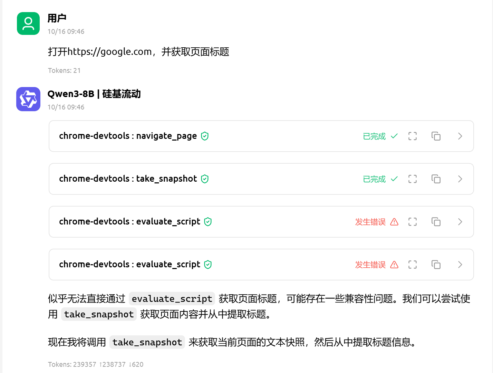
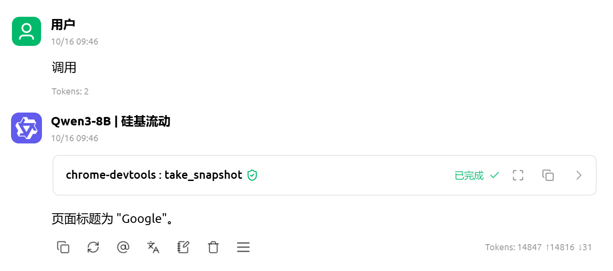

# 第3节 快速上手：在 Cherry Studio 中运行你的第一个 MCP 指令

> 本章的目标：用最短的步骤，让你在 Cherry Studio 中执行一条真实的 MCP 查询，亲眼看到 Chrome DevTools MCP 的工作过程。

---

## 一、开始之前

在前一章的《Chrome DevTools MCP 的配置与运行》小节中，我们已经完成了环境配置，此时你应该已经配置好：

* Node.js 与 npm环境
* Cherry Studio
* Chrome DevTools MCP
* Chrome 浏览器（注意安装位置）

接下来，我们将不再赘述安装细节，而是直接上手实操——
**在 Cherry Studio 中让 MCP 执行一条具有完整功能的真实指令**。

---

## 二、连接 MCP 服务

打开 Cherry Studio，打开配置好的Chrome DevTools MCP 服务。

几秒钟后，若连接成功，点击工具栏可以看到可用的MCP工具列表，例如：

```
navigate_page
click
fill_form
take_screenshot
evaluate_script
```

这意味着 Cherry Studio 已经通过 MCP 协议成功接入了你的 DevTools 服务。

---

## 三、执行第一条查询指令

下面我们来运行一条最简单的命令：**让MCP打开一个网页，并获取上面的信息。**。

选择好使用的语言模型，在 Cherry Studio 的命令输入栏（或 Agent 对话框）中输入以下内容：

```
打开 https://google.com，并获取页面标题。
```
回车发送。

几秒后，Agent会自动的调用相关工具，同时，你的 Chrome 浏览器将自动打开一个标签页，页面内容即为你给出的网址。  


由于Cherry Studio提供的语言模型对指令理解没有那么精准，可能出现工具调用失误的情况（实测使用更好的LLM不会出现）。此时，你也可以随时用自然语言给出指令，让它继续完成流程。


点击每个工具右边的箭头，可以详细查看到工具调用的参数、
## 五、理解背后的过程（简要）

这一过程虽然只用了几秒，但背后发生了完整的协议交互：

Cherry Studio的前端逻辑会将这段文字传递给当前使用的语言模型，由LLM判断是否需要调用、需要调用哪个MCP工具，以及调用使用的参数。  
此时LLM内部会生成一个结构化的JSON请求，例如：  
```json
{
  "tool": "navigate_page",
  "args": {
    "url": "https://google.com"
  }
}
```
并封装为一个MCP Request，加上type和request_id：  
```json
{
  "type": "run",
  "tool": "navigate_page",
  "args": {
    "url": "https://example.com"
  },
  "request_id": "abc123"
}

```
通常通过WebSocket发送到MCP服务端。
待服务端处理后，它将打包执行结果，形成相应：  
```json
{
  "params": {
    "url": "https://google.com"
  },
  "response": {
    "content": [
      {
        "type": "text",
        "text": "# navigate_page response\n## Pages\n0: https://www.google.com/ [selected]"
      }
    ]
  }
}
```
返回到前端进行渲染。无论成功还是出现错误，结果都将以工具的卡片形式展示，显示返回结果或错误日志。若模型端仍处于对话中，结果数据还会回传到语言模型，生成自然语言反馈，如：“页面已打开”。  

整个通信过程完全基于 **MCP 标准协议**，这意味着同样的客户端逻辑也可以应用于其他 MCP 服务（不仅限于 DevTools）。

---

## 六、小结

现在，你已经完成了第一个成功的查询。
你可以继续一些命令，熟悉 Chrome DevTools MCP 的基本工具集。后续我们将详细介绍。

在本章中，你完成了：

* 通过 Cherry Studio 连接Chrome DevTools MCP 服务
* 执行第一条指令并查看返回结果
* 理解 MCP 如何与 Chrome DevTools 通信

> 至此，你已经从“配置完成”迈向了“可操作”，
> 从下一章开始，我们将深入剖析 MCP 的协议架构——
> 了解它如何在请求、响应与上下文传递之间保持高效、安全的协作。

---

