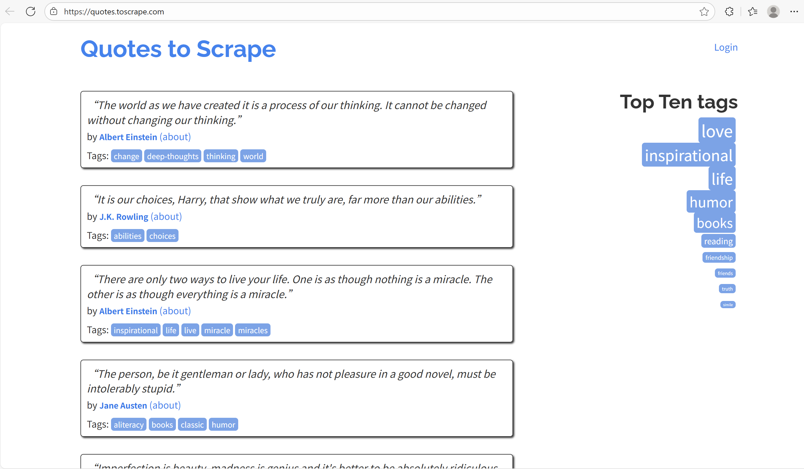

# 第4节 Chrome DevTools MCP 基础工具和指令解析

## 4.1 测试环境说明

- 测试用网站：<https://quotes.toscrape.com>
这是一个爬虫技巧练习网站，首页截图如下。包含多个名人名言、标签、作者信息以及登录键。

以及本地的网站 <smart-campus-admin.html> 
这是一个智慧校园管理系统的登录界面。登录之后，可以执行查看表格信息、下载表格等操作。

- 浏览器：Chrome
- 语言模型：Qwen3-8B
- 测试平台：Cherry Studio、Cursor


## 4.2 工具测试

Cursor 显示共 26 个 tool，与 GitHub repo 一致。

### 浏览器交互工具
以下使用cursor测试Chrome DevTools MCP 浏览器相关的工具。
- prompt1: 打开 https://quotes.toscrape.com，返回页面上所有 `.quote` 元素的文本。

##### navigate page

功能：定向到给定的 url。

参数：

```json
{
  "url": "https://quotes.toscrape.com",
  "timeout": 10000
}
```

结果：成功使用 Chrome 浏览器打开网站。

##### evaluate_script

功能：评估选中的 url 的脚本，response 为 JSON 格式。

参数：

```json
{
  "function": "() => {\n  const quotes = document.querySelectorAll('.quote');\n  const quoteTexts = [];\n  \n  quotes.forEach((quote, index) => {\n    const text = quote.textContent.trim();\n    quoteTexts.push({\n      index: index + 1,\n      text: text\n    });\n  });\n  \n  return {\n    totalQuotes: quotes.length,\n    quotes: quoteTexts\n  };\n}"
}
```

这是一个匿名函数，让工具选出页面上所有类别为 `.quote` 的元素，并返回一个包含所有元素文本的 JSON 文件。

结果：

页面上一共有 10 个引用，以下是所有引用的文本内容：

1. Albert Einstein

"The world as we have created it is a process of our thinking. It cannot be changed without changing our thinking."

标签: change, deep-thoughts, thinking, world

2. J.K. Rowling

"It is our choices, Harry, that show what we truly are, far more than our abilities."

标签: abilities, choices

……

所有 quote 都被列出。

- prompt2: 给出页面的一个 snapshot。

##### take_snapshot

功能：给出选中页面的快照。

参数：无。

结果：

```
uid=1_0 RootWebArea "Quotes to Scrape"
  uid=1_1 heading "Quotes to Scrape" level="1"
  uid=1_2 link "Login"
    uid=1_3 StaticText "Login"
  uid=1_4 StaticText "“The world as we have created it is a process of our thinking. It cannot be changed without changing our thinking.”"
  uid=1_5 StaticText "by "
  uid=1_6 StaticText "Albert Einstein"
  ……
```

可以看到，给出了页面上的所有元素，且每个元素都被赋予了一个唯一的 uid。

- prompt3：点击第一条 quote 中的作者链接，等待至新页面上作者信息出现。

##### click

功能：点击特定 uid 的元素。

参数：uid。

结果：工具首先尝试点击 Albert Einstein，但失败，因为它不是一个链接。它又尝试点击旁边的 about，成功。click 返回了新页面的快照。

##### wait_for

功能：等待特定文本出现。

参数：文本、timeout。

结果：待到信息页面跳转成功，返回快照。agent 还给出了页面上的内容的总结。

- prompt4：进入登录界面，输入账号 hsq, 密码 1008，并提交。

##### fill / fill_form

功能：将指定内容填充进指定元素。

参数：uid, value。例如：

```json
{
  "uid": "7_7",
  "value": "1008"
}
```

结果：成功输入、点击登录，返回快照。

- prompt5：在页面中创建一个可以拖动的方块和目标区，然后拖动它过去。

##### drag

功能：拖动元素。

参数：源位置和目标位置的 uid。

结果：成功拖拽，显示拖拽成功。这个功能应该可以用于自动上传解析文件/改变布局等。在我之前看过的 blenderMCP 中可能更重要一些。

- prompt6：弹出一个 javascript 确认框，点击确定。

##### handle_dialog

功能：处理网页的弹窗。

参数：action 确认还是取消；text 可选的输入文本（这里没有）

```json
{
  "action": "accept"
}
```

- prompt7：创建一个文件上传区，上传我本地桌面上的 "方向.docx" 文件。

##### upload_file

功能：在指定的元素上传文件。

参数：uid, file_path。例如：

```json
{
  "uid": "16_221",
  "filePath": "C:\\Users\\33544\\Desktop\\方向.docx"
}
```

结果：成功上传，返回快照。（截图）

- prompt8：把鼠标悬停在首页右边第一个标签上，告诉我它的内容。

##### hover

功能：悬停在指定元素上。

参数：uid。

结果：成功悬停，调用 evaluate_script 返回标签的文本。LLM告诉我们，第一个标签 love 的类型，以及它是一个可点击的链接。

- prompt9: 新开一个页面前往 https://quotes.toscrape.com/tag/life/。列出所有已经打开的页面及其 url，然后关掉旧的标签页。

##### new_page

功能：创建一个新的标签页，前往指定网站（navigate 是直接在当前标签页打开）。

参数：url, timeout。例如：

```json
{
  "url": "https://quotes.toscrape.com/tag/life/",
  "timeout": 10000
}
```

结果：成功打开新的标签页，并返回一个所有页面 url 的 list（包括当前是哪个页面的标识）：
```json
# new_page response
## Pages
0: https://quotes.toscrape.com/
1: https://quotes.toscrape.com/tag/life/ [selected]
```
##### list_pages

功能：列出所有打开的页面及其 url。

参数：无。

结果：

```json
# list_pages response
## Pages
0: https://quotes.toscrape.com/
1: https://quotes.toscrape.com/tag/life/ [selected]
```
(和上面一样)

##### close_page

功能：关闭指定页面。

参数：pageIdx。

结果：成功关闭页面，返回剩余所有页面 url 的 list。

.# close_page response
.## Pages
0: https://quotes.toscrape.com/tag/life/ [selected]

- prompt10: 创建一个新标签页，前往 https://www.google.com/。切换到原来的标签页。

##### select_page

功能：切换到指定页面。

参数：pageIdx。

结果：成功切换页面，返回剩余所有页面 url 的 list。

```json
# select_page response
## Pages
0: https://quotes.toscrape.com/tag/life/ [selected]
1: https://www.google.com/
```

### 浏览器性能监测工具
以下使用Cherry Studio测试。  

- prompt11: 用浏览器打开smart-campus-admin.html，分析当前页面性能，哪些地方加载慢？并开启页面性能追踪持续五秒钟，汇总关键数据加载时间、请求数量等。  
performance_analyze_insight
performance_start_trace
performance_stop_trace
##### performance_start_trace/performance_stop_trace
功能：开启或关闭页面性能追踪。  
参数：reload, autostop（均为布尔值）。  
结果：工具自动开启、关闭了性能追踪，并返回了5秒内捕捉到的性能数据。  
```json
{
  "params": {
    "reload": true,
    "autoStop": true
  },
  "response": {
    "content": [
      {
        "type": "text",
        "text": "# performance_start_trace response\nThe performance trace has been stopped.\n## Summary of Performance trace findings:\nURL: file:///D:/%E5%AD%A6%E4%B9%A0/%E5%AE%9E%E4%B9%A0/mcp/smart-campus-admin.html\nBounds: {min: 3176859751, max: 3182012275}\nCPU throttling: none\nNetwork throttling: none\nMetrics (lab / observed):\n  - LCP: 144 ms, event: (eventKey: r-2102, ts: 3177005357), nodeId: 461\n  - LCP breakdown:\n    - TTFB: 0.4 ms, bounds: {min: 3176861549, max: 3176861970}\n    - Render delay: 143 ms, bounds: {min: 3176861970, max: 3177005357}\n  - CLS: 0.00\nMetrics (field / real users): n/a – no data for this page in CrUX\nAvailable insights:\n  - insight name: LCPBreakdown\n    description: Each [subpart has specific improvement strategies](https://web.dev/articles/optimize-lcp#lcp-breakdown). Ideally, most of the LCP time should be spent on loading the resources, not within delays.\n    relevant trace bounds: {min: 3176861549, max: 3177005357}\n    example question: Help me optimize my LCP score\n    example question: Which LCP phase was most problematic?\n    example question: What can I do to reduce the LCP time for this page load?\n  - insight name: RenderBlocking\n    description: Requests are blocking the page's initial render, which may delay LCP. [Deferring or inlining](https://web.dev/learn/performance/understanding-the-critical-path#render-blocking_resources) can move these network requests out of the critical path.\n    relevant trace bounds: {min: 3176919428, max: 3176946404}\n    example question: Show me the most impactful render blocking requests that I should focus on\n    example question: How can I reduce the number of render blocking requests?\n  - insight name: ThirdParties\n    description: 3rd party code can significantly impact load performance. [Reduce and defer loading of 3rd party code](https://web.dev/articles/optimizing-content-efficiency-loading-third-party-javascript/) to prioritize your page's content.\n    relevant trace bounds: {min: 3176919428, max: 3176998598}\n    example question: Which third parties are having the largest impact on my page performance?\n\n## Details on call tree & network request formats:\nInformation on performance traces may contain main thread activity represented as call frames and network requests.\n\nEach call frame is presented in the following format:\n\n'id;eventKey;name;duration;selfTime;urlIndex;childRange;[S]'\n\nKey definitions:\n\n* id: A unique numerical identifier for the call frame. Never mention this id in the output to the user.\n* eventKey: String that uniquely identifies this event in the flame chart.\n* name: A concise string describing the call frame (e.g., 'Evaluate Script', 'render', 'fetchData').\n* duration: The total execution time of the call frame, including its children.\n* selfTime: The time spent directly within the call frame, excluding its children's execution.\n* urlIndex: Index referencing the \"All URLs\" list. Empty if no specific script URL is associated.\n* childRange: Specifies the direct children of this node using their IDs. If empty ('' or 'S' at the end), the node has no children. If a single number (e.g., '4'), the node has one child with that ID. If in the format 'firstId-lastId' (e.g., '4-5'), it indicates a consecutive range of child IDs from 'firstId' to 'lastId', inclusive.\n* S: _Optional_. The letter 'S' terminates the line if that call frame was selected by the user.\n\nExample Call Tree:\n\n1;r-123;main;500;100;;\n2;r-124;update;200;50;;3\n3;p-49575-15428179-2834-374;animate;150;20;0;4-5;S\n4;p-49575-15428179-3505-1162;calculatePosition;80;80;;\n5;p-49575-15428179-5391-2767;applyStyles;50;50;;\n\n\nNetwork requests are formatted like this:\n`urlIndex;eventKey;queuedTime;requestSentTime;downloadCompleteTime;processingCompleteTime;totalDuration;downloadDuration;mainThreadProcessingDuration;statusCode;mimeType;priority;initialPriority;finalPriority;renderBlocking;protocol;fromServiceWorker;initiators;redirects:[[redirectUrlIndex|startTime|duration]];responseHeaders:[header1Value|header2Value|...]`\n\n- `urlIndex`: Numerical index for the request's URL, referencing the \"All URLs\" list.\n- `eventKey`: String that uniquely identifies this request's trace event.\nTimings (all in milliseconds, relative to navigation start):\n- `queuedTime`: When the request was queued.\n- `requestSentTime`: When the request was sent.\n- `downloadCompleteTime`: When the download completed.\n- `processingCompleteTime`: When main thread processing finished.\nDurations (all in milliseconds):\n- `totalDuration`: Total time from the request being queued until its main thread processing completed.\n- `downloadDuration`: Time spent actively downloading the resource.\n- `mainThreadProcessingDuration`: Time spent on the main thread after the download completed.\n- `statusCode`: The HTTP status code of the response (e.g., 200, 404).\n- `mimeType`: The MIME type of the resource (e.g., \"text/html\", \"application/javascript\").\n- `priority`: The final network request priority (e.g., \"VeryHigh\", \"Low\").\n- `initialPriority`: The initial network request priority.\n- `finalPriority`: The final network request priority (redundant if `priority` is always final, but kept for clarity if `initialPriority` and `priority` differ).\n- `renderBlocking`: 't' if the request was render-blocking, 'f' otherwise.\n- `protocol`: The network protocol used (e.g., \"h2\", \"http/1.1\").\n- `fromServiceWorker`: 't' if the request was served from a service worker, 'f' otherwise.\n- `initiators`: A list (separated by ,) of URL indices for the initiator chain of this request. Listed in order starting from the root request to the request that directly loaded this one. This represents the network dependencies necessary to load this request. If there is no initiator, this is empty.\n- `redirects`: A comma-separated list of redirects, enclosed in square brackets. Each redirect is formatted as\n`[redirectUrlIndex|startTime|duration]`, where: `redirectUrlIndex`: Numerical index for the redirect's URL. `startTime`: The start time of the redirect in milliseconds, relative to navigation start. `duration`: The duration of the redirect in milliseconds.\n- `responseHeaders`: A list (separated by '|') of values for specific, pre-defined response headers, enclosed in square brackets.\nThe order of headers corresponds to an internal fixed list. If a header is not present, its value will be empty.\n"
      }
    ]
  }
}
```
这段很长的Chrome DevTools MCP性能追踪报告，是一次完整的页面性能采样数据总结，内容分为性能摘要（追踪状态、测试页面信息、测试环境、LCP、CLS等性能指标）、性能insight（LCPBreakdown、渲染阻塞、第三方代码影响）、性能追踪格式说明（调用栈、网络请求等）。放心，这不是给我们阅读的，而（一部分）将作为performance_analyze_insight的参数，由这个工具进一步分析，回答我们的问题。  

##### performance_analyze_insight
功能：根据性能追踪获得的insight，具体分析特定页面的性能表现。  
参数：insight名（如LCPBreakdown）  
结果：返回对LCP的分析
```json
{
  "params": {
    "insightName": "LCPBreakdown"
  },
  "response": {
    "content": [
      {
        "type": "text",
        "text": "# performance_analyze_insight response\n## Insight Title: LCP breakdown\n\n## Insight Summary:\nThis insight is used to analyze the time spent that contributed to the final LCP time and identify which of the 4 phases (or 2 if there was no LCP resource) are contributing most to the delay in rendering the LCP element.\n\n## Detailed analysis:\nThe Largest Contentful Paint (LCP) time for this navigation was 144 ms.\nThe LCP element is text and was not fetched from the network.\n\nWe can break this time down into the 2 phases that combine to make the LCP time:\n\n- Time to first byte: 0.4 ms (0.3% of total LCP time)\n- Element render delay: 143 ms (99.7% of total LCP time)\n\n## Estimated savings: none\n\n## External resources:\n- https://web.dev/articles/lcp\n- https://web.dev/articles/optimize-lcp"
      }
    ]
  }
}
```
并使用自然语言描述：
LCP (Largest Contentful Paint) 是衡量网页性能的重要指标，它表示用户在页面加载过程中看到最大内容块的时刻。对于当前页面，LCP 时间为 144 毫秒，且 LCP 元素是文本，是本地生成的，并没有从网络获取。
LCP 时间可以分为两个阶段：
Time to First Byte (TTFB): 0.4 毫秒，占总 LCP 时间的 0.3%。
Element render delay: 143 毫秒，占总 LCP 时间的 99.7%。
从分析结果来看，LCP 主要是由于渲染延迟造成的，因此，我们应关注渲染延迟的主要因素并尝试优化。下文为你在页面中能找到的外部资源链接，或许可以给你的分析提供更多的信息。
LLM很清晰地为我们提供了这个demo网站目前性能瓶颈分析以及修改建议。这对于网页开发十分便利。  


### 浏览器模拟工具
开发网页时，我们也需要考虑它未来将在什么设备上运行，并尽量优化它，使其在条件较差的设备上仍能表现良好。Chrome DevTools MCP提供了这样的模拟工具。  
- prompt12: 模拟一台慢cpu（4倍减速）运行当前页面，再测量加载性能，是否变慢？
##### emulate_cpu
功能：模拟一台给定性能的CPU运行给定的页面。  
参数：CPU性能（如4倍减速）  
结果：成功地模拟了CPU性能，并结合监测工具返回了加载性能数据。LLM报告说到，由于 CPU 被模拟为 4 倍减速，而页面的 LCP（最大内容绘制）元素是本地生成的文本，因此导航的 LCP 时间主要由渲染延迟决定。从分析结果可以看出，在 CPU 模拟的条件（4x 减速）下，LCP 时间是 518 毫秒，且 LCP 元素是文本类型，是本地生成的，并没有从网络获取。

在模拟慢 CPU 的情况下，LCP 时间的两个主要阶段如下：

Time to First Byte (TTFB): 0.5 毫秒（占据了 LCP 总时间的 0.1%），这部分与网络请求相关，但时间非常短，显示出这个阶段影响不大。
Element render delay: 518 毫秒（占据了 LCP 总时间的 99.9%），这部分主要是由于系统的内存和处理能力有限，页面渲染变慢导致。
概述来说，模拟慢 CPU 对 LCP 时间产生了显著影响，尤其是引起渲染延迟的增加。因此，加载性能变慢，归因于渲染过程受 CPU 结构的制约。为了进一步优化性能，应考虑减少渲染延迟和优化本地执行效率。  
可以看出，由于性能下降，LCP时间显著延长，LLM也给出了相应的分析和修改建议。  


- prompt13: 把浏览器窗口调成手机尺寸，返回当前窗口的宽高，然后把网络环境改为slow 3G,重新加载页面，分析效率之后回调网络环境。  
##### resize_page
功能：调整页面的尺寸。  
参数：宽高.例如此处为
```json
"params": {
    "width": 360,
    "height": 640
  }
```
结果：成功调整了页面尺寸。

##### emulate_network
功能：模拟给定网络环境运行给定的页面。  
参数：网络环境（如slow 3G）  
结果：成功模拟了网络环境，并结合监测工具返回了加载性能数据。
LCP（Largest Contentful Paint）：411毫秒，主要延迟发生在渲染阶段。
TTFB（Time to First Byte）：0.5毫秒，这部分时间非常短，影响不大。
渲染延迟（Render delay）：410毫秒，显著增加，表现出CPU模拟对页面性能的制约。  
网络主要影响渲染延迟，使其显著增加。  


### 网页请求追踪工具
- prompt14: 打开D:/学习/实习/mcp/smart-campus-admin.html，在页面上执行一些跳转，然后展示当前历史页面记录。接着列出最近所有网络请求（包括JS、CSS、API调用），结果以表格形式给我。  

##### navigate_page_history
功能：跳转到导航历史中的指定页面。  
参数：navigate，代表是向前还是向后跳转。例子中是"back".  
结果：成功跳转页面，回到登录界面。  

##### list_network_requests
功能：列出自上次跳转以后，当前页面的所有网络请求。  
参数：pageSize（最多返回请求条数）,pageIndex（页面序号）,resourceType（请求资源类型，用于过滤请求）  
结果：
```json
# list_network_requests response
## Network requests
Showing 1-7 of 7 (Page 1 of 1).
file:///D:/%E5%AD%A6%E4%B9%A0/%E5%AE%9E%E4%B9%A0/mcp/smart-campus-admin.html GET [success - 200]
https://cdn.jsdelivr.net/npm/bootstrap@5.3.3/dist/css/bootstrap.min.css GET [success - 200]
https://cdn.jsdelivr.net/npm/bootstrap-icons@1.11.3/font/bootstrap-icons.css GET [success - 200]
https://cdn.jsdelivr.net/npm/xlsx@0.18.5/dist/xlsx.full.min.js GET [success - 200]
https://cdn.jsdelivr.net/npm/bootstrap@5.3.3/dist/js/bootstrap.bundle.min.js GET [success - 200]
data:image/svg+xml,%3csvg xmlns='http://www.w3.org/2000/svg' viewBox='0 0 16 16'%3e%3cpath fill='none' stroke='%23343a40' stroke-linecap='round' stroke-linejoin='round' stroke-width='2' d='m2 5 6 6 6-6'/%3e%3c/svg%3e GET [success - 200]
https://cdn.jsdelivr.net/npm/bootstrap-icons@1.11.3/font/fonts/bootstrap-icons.woff2?dd67030699838ea613ee6dbda90effa6 GET [success - 200]
```
工具成功返回网络请求，并通过LLM以表格形式呈现。  


- prompt15: 请打开本地的 smart-campus-admin.html 页面，等页面加载完成后调用 list_network_requests 查看所有请求。
然后随机选取其中一个网络请求，用 get_network_request 查看其详细信息（如 URL、Headers、Response 状态）。最后总结该请求的主要信息。

##### get_network_request
功能：获取一个指定网络请求的详细信息。  
参数：请求的url。这里是list_network_requests返回的其中一个请求url。   
```json
{
  "url": "https://cdn.jsdelivr.net/npm/bootstrap@5.3.3/dist/css/bootstrap.min.css"
}
```
结果：成功获取了该请求的详细信息，经LLM总结后如下。
请求明细（随机选择）：
URL: https://cdn.jsdelivr.net/npm/bootstrap@5.3.3/dist/css/bootstrap.min.css
方法: GET
状态: 200
响应头部（部分）:
content-type: text/css; charset=utf-8
content-encoding: br
cache-control: public, max-age=31536000, s-maxage=31536000, immutable
access-control-allow-origin: *
x-jsd-version: 5.3.3
content-length: 33206
server: cloudflare
请求头部（部分）:
user-agent: Mozilla/5.0 (Windows NT 10.0; Win64; x64) AppleWebKit/537.36 (KHTML, like Gecko) Chrome/141.0.0.0 Safari/537.36
sec-ch-ua: "Google Chrome";v="141", "Not?A_Brand";v="8", "Chromium";v="141"
sec-ch-ua-platform: "Windows"
结论：
这是从 jsdelivr CDN 拉取的 Bootstrap v5.3.3 样式表，请求成功（200），启用了 Brotli 压缩和长期缓存策略（immutable，max-age 一年），跨域允许（Access-Control-Allow-Origin: ）。  

### Debugging工具
- prompt16: 载入刚才的登录界面后，调用 list_console_messages（即使还未有消息也执行一次），然后执行一次 take_screenshot 截图当前页面。把截图保存到默认输出目录，并告诉我截图文件路径。

##### list_console_messages
功能：列出当前页面的 JavaScript 运行时产生的所有消息。  
参数：无
结果：成功列出了信息。由于当前没有产生消息，这里返回了无。  
```json
# list_console_messages response
## Console messages
<no console messages found>
```

##### take_screenshot
功能：对某个页面或元素截屏。  
参数：格式、图像质量、uid、是否截全整个页面、保存路径。  
例子中是
```json
{
  "format": "png",
  "fullPage": true
}
```
结果：成功把截图保存到默认路径.cursor/mcp-screenshots/page-1.png，如下：  


## 4.3 小结
以上，我们完成了对26个Chrome DevTools MCP工具的测试。相信你已经对它们的功能和调用方式有所熟悉，你可以通过自己设计的提示词，进一步尝试更多的用法。接下来，我们将进入到核心概念章节，从源代码着手深入地理解Chrome DevTools MCP的组成部分和运行原理。